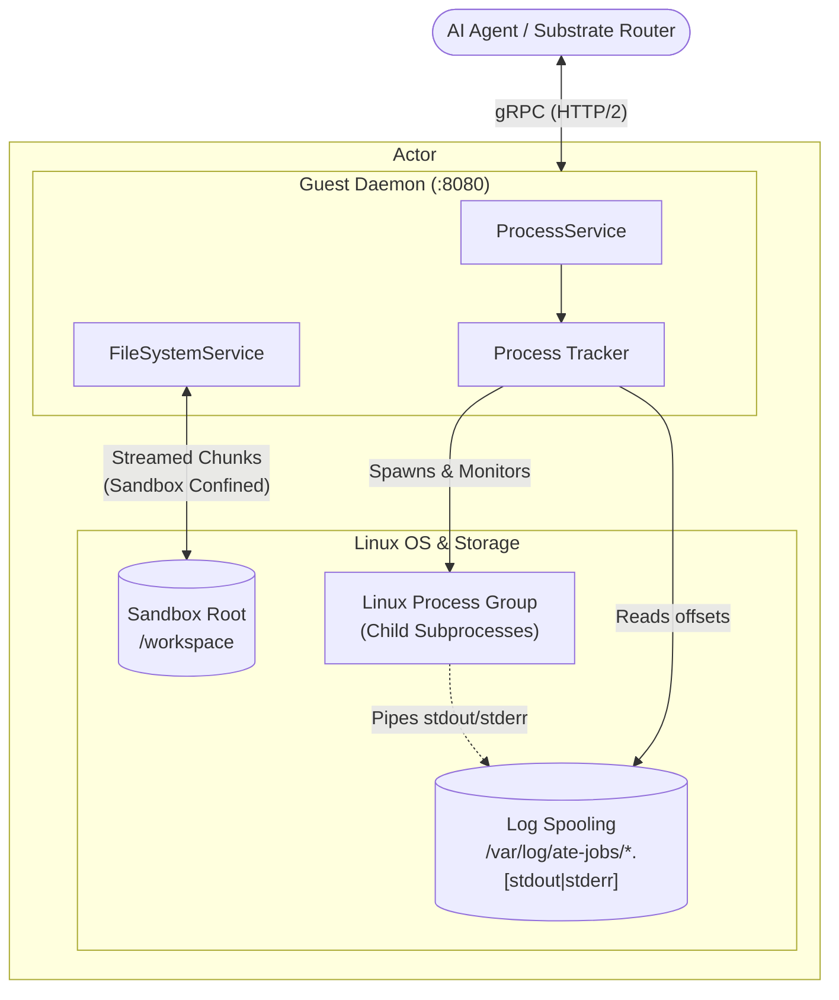

# Agent Substrate Guest Daemon Example

This directory contains a reference implementation of an in-container **Guest Daemon** for Agent Substrate environments.

It demonstrates how to assemble **`ProcessService`** and **`FileSystemService`** from the `guest` package into a standalone gRPC server, package it into a minimal container, and run it.

---

## Architecture



---

## Directory Contents

- **`main.go`**: Assembles `process.Service` and `filesystem.Service` onto a single gRPC server with reflection and signal handling.
- **`main_test.go`**: End-to-end integration test demonstrating script uploading, process execution, and log streaming.
- **`Dockerfile`**: Multi-stage container build producing a minimal image with the compiled `guest-daemon` binary.

---

## 1. Running the Daemon Locally

To test the daemon on your local machine:

```bash
go run ./examples/guest-daemon --listen=:8080 --log-dir=/tmp/ate-jobs --workdir=/tmp/workspace
```

---

## 2. Running the Integration Tests

Run the full end-to-end test suite:

```bash
go test -v -race ./examples/guest-daemon/...
```

---

## 3. Testing with `grpcurl`

Since reflection is enabled, you can interact directly with the running daemon using [`grpcurl`](https://github.com/fullstorydev/grpcurl):

```bash
# If grpcurl is not in your PATH, you can install it or invoke ~/go/bin/grpcurl:
go install github.com/fullstorydev/grpcurl/cmd/grpcurl@latest
export PATH=$PATH:$(go env GOPATH)/bin
```

### Start a Background Command
```bash
grpcurl -plaintext -d '{"command": ["echo", "Hello Substrate!"]}' \
  localhost:8080 ateenv.v1.ProcessService/StartProcess
```

### Inspect Process Status
```bash
grpcurl -plaintext -d '{"process_id": "<process-id-from-start>"}' \
  localhost:8080 ateenv.v1.ProcessService/GetProcess
```

### Stream Real-Time Logs
```bash
grpcurl -plaintext -d '{"process_id": "<process-id>", "follow": true}' \
  localhost:8080 ateenv.v1.ProcessService/StreamProcessLogs
```

### Terminate a Process
```bash
grpcurl -plaintext -d '{"process_id": "<process-id>"}' \
  localhost:8080 ateenv.v1.ProcessService/KillProcess
```

### Write a File (Streamed)
```bash
echo '{"path": "hello.txt", "chunk": "SGVsbG8gU3Vic3RyYXRlIQo=", "mode": 420}' | \
  grpcurl -plaintext -d @ localhost:8080 ateenv.v1.FileSystemService/WriteFile
```

### Read a File (Streamed)
```bash
grpcurl -plaintext -d '{"path": "hello.txt"}' \
  localhost:8080 ateenv.v1.FileSystemService/ReadFile
```

---

## 4. Building the Container Image

Build the minimal container image:
```bash
docker build -t us-docker.pkg.dev/my-project/ate-env-guest:latest -f examples/guest-daemon/Dockerfile .
```
