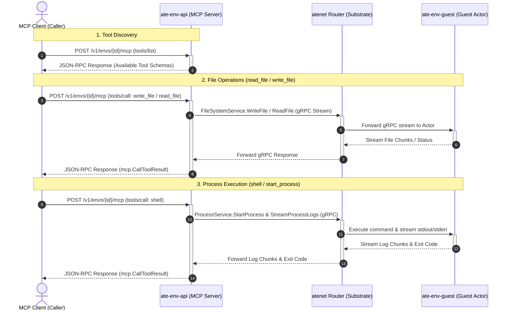

# Model Context Protocol (MCP) Example

This example demonstrates how AI agents and MCP clients connect to an environment using the official **[Model Context Protocol](https://modelcontextprotocol.io/)** Go SDK (`github.com/modelcontextprotocol/go-sdk/mcp`).

`ate-env-api` serves standard MCP over Streamable HTTP at `/v1/envs/{id}/mcp`, dynamically translating MCP JSON-RPC tool calls into `FileSystemService` and `ProcessService` gRPC operations executed inside the guest actor.

---

## Architecture



---

## Available MCP Tools

| Tool | Description | Mode |
| :--- | :--- | :--- |
| **`read_file`** | Read file content from the environment workspace. | Synchronous |
| **`write_file`** | Write file content to the environment workspace. | Synchronous |
| **`shell`** | Run a shell command line (`sh -c "<command>"`) with stdout, stderr, and exit code. | Synchronous |
| **`start_process`** | Launch a background process inside the container. | Asynchronous |
| **`get_process`** | Retrieve process status, exit code, and timestamps. | Synchronous |
| **`stream_process_logs`**| Stream or read stdout and stderr logs of a process. | Streaming / Polling |
| **`kill_process`** | Terminate a running background process. | Synchronous |

---

## Running the Example

### 1. Port-forward `ate-env-api` (on a Kubernetes cluster)
```bash
kubectl port-forward -n ate-env svc/ate-env-api 7777:7777
```

### 2. Run the Go MCP Client

```bash
go run ./examples/mcp/main.go
```

The example will:
1. Initialize an MCP client via `github.com/modelcontextprotocol/go-sdk/mcp`.
2. Connect to `http://localhost:7777/v1/envs/{env}/mcp`.
3. Discover tools via `tools/list`.
4. Execute `shell` (`uname -a`) and print the result.

---

## Testing via `curl` (JSON-RPC 2.0)

You can send standard JSON-RPC HTTP POST requests directly to any environment's MCP endpoint:

### 1. List Available Tools
```bash
curl -X POST http://localhost:7777/v1/envs/my-env/mcp \
  -H "Content-Type: application/json" \
  -H "Accept: application/json, text/event-stream" \
  -d '{
    "jsonrpc": "2.0",
    "id": 1,
    "method": "tools/list"
  }'
```

### 2. Write a File
```bash
curl -X POST http://localhost:7777/v1/envs/my-env/mcp \
  -H "Content-Type: application/json" \
  -H "Accept: application/json, text/event-stream" \
  -d '{
    "jsonrpc": "2.0",
    "id": 2,
    "method": "tools/call",
    "params": {
      "name": "write_file",
      "arguments": {
        "path": "app/main.py",
        "content": "print(\"Hello from MCP!\")"
      }
    }
  }'
```

### 3. Run a Shell Command
```bash
curl -X POST http://localhost:7777/v1/envs/my-env/mcp \
  -H "Content-Type: application/json" \
  -H "Accept: application/json, text/event-stream" \
  -d '{
    "jsonrpc": "2.0",
    "id": 3,
    "method": "tools/call",
    "params": {
      "name": "shell",
      "arguments": {
        "command": "python3 app/main.py"
      }
    }
  }'
```

### 4. Read a File
```bash
curl -X POST http://localhost:7777/v1/envs/my-env/mcp \
  -H "Content-Type: application/json" \
  -H "Accept: application/json, text/event-stream" \
  -d '{
    "jsonrpc": "2.0",
    "id": 4,
    "method": "tools/call",
    "params": {
      "name": "read_file",
      "arguments": {
        "path": "app/main.py"
      }
    }
  }'
```
